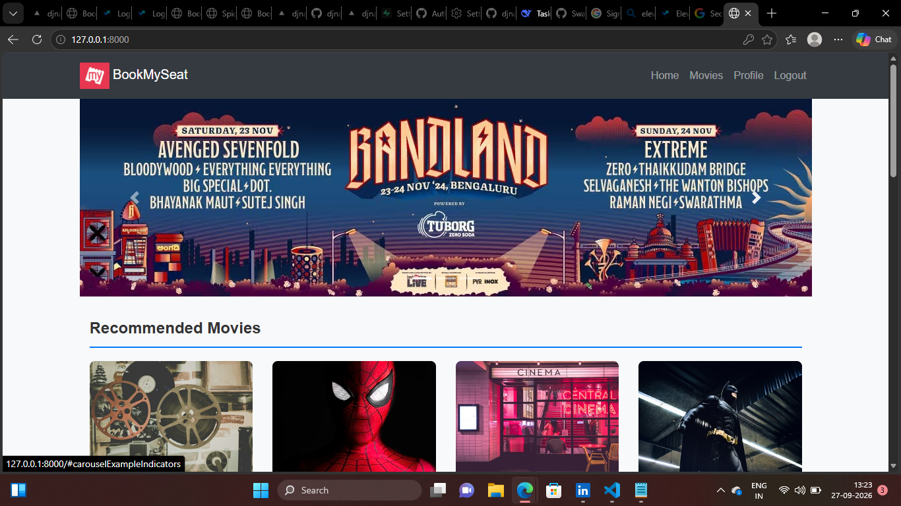
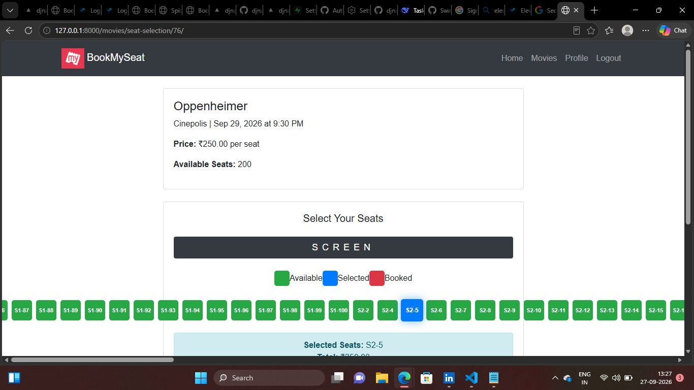
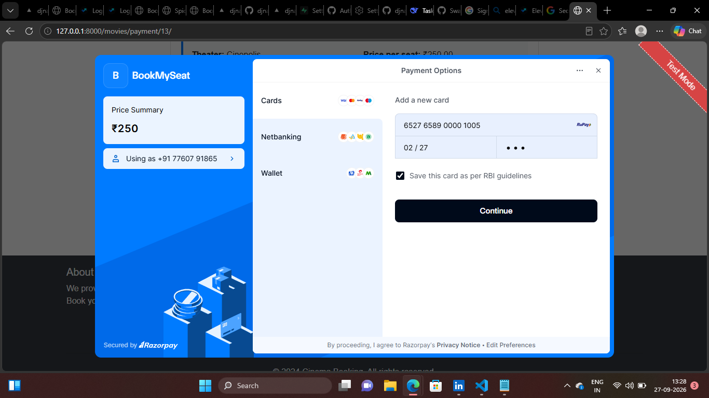
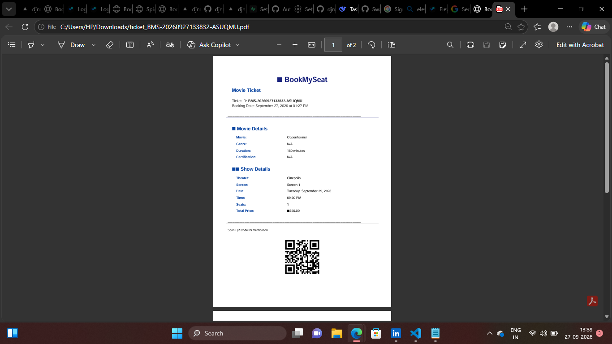
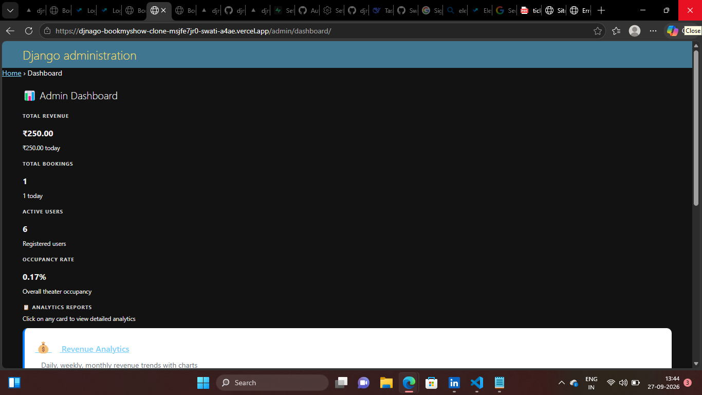

# 🎬 BookMySeat — Online Movie Ticket Booking System

A full-stack Django application for browsing movies, booking seats, paying online, and receiving automated PDF tickets with QR codes via email.

**Live Demo:** [djnago-bookmyshow-clone-eight.vercel.app](https://djnago-bookmyshow-clone-eight.vercel.app/)

**Admin Panel:** [/admin/](https://djnago-bookmyshow-clone-eight.vercel.app/admin/)
- Username: `swati10`
- Password: `Admin@1234`

---

## 📋 Features

### Task 1 — Movie Management
- Admin CRUD for movies, genres, languages, cast, theaters, and shows
- YouTube trailer embedding
- Multiple poster support, age certification, duration, descriptions
- User reviews with auto-calculated average rating
- Similar movie recommendations

### Task 2 — Smart Seat Reservation
- Live seat availability (available / reserved / booked)
- 2-minute seat lock during payment
- Transaction-safe — prevents duplicate bookings under concurrency
- AJAX-based seat selection

### Task 3 — Payment Workflow (Razorpay)
- Order creation, signature verification, capture
- Payment retry support
- Webhook verification
- Booking confirmed only after successful payment
- Failed payments automatically release seats
- Complete payment history

### Task 4 — Admin Dashboard
- Daily, weekly, monthly, yearly revenue
- Occupancy percentage per theater
- Most booked movies, top theaters
- Peak booking hours
- Cancellation and refund statistics
- User growth reports
- Custom date range filtering
- CSV export
- Staff-only access with Django permissions
- Optimized ORM aggregations with database indexes

### Task 5 — Movie Discovery
- Search by title
- Filter by genre, language, city, theater, release date, rating, showtime
- Sort by popularity, newest, rating, price
- Live match count
- Pagination
- "Recommended for You" based on booking history and viewed movies

### Task 6 — Automated Ticket + Email
- Auto-generated PDF ticket with:
  - Movie details, theater, screen, showtime
  - Booked seats, booking ID, payment reference
  - QR code for verification
- **Asynchronous email delivery via Celery**
- Booking process never waits for email
- Failed emails auto-retry (up to 3 times)
- Download tickets from booking history
- View ticket in browser
- Resend email option

---

## 🛠 Tech Stack

| Layer | Technology |
|---|---|
| Backend | Django 5.1 (Python 3.12) |
| Database | PostgreSQL (Supabase) |
| Task Queue | Celery + Redis |
| Payment | Razorpay |
| Media Storage | Cloudinary |
| Frontend | HTML, Bootstrap 5, JavaScript |
| PDF Generation | ReportLab |
| QR Codes | qrcode + Pillow |
| Email | Gmail SMTP |
| Deployment | Vercel |
| Static Files | WhiteNoise |

---

## 🚀 How to Run the Project Locally

### Prerequisites

- Python 3.12+
- Redis (for Celery)
- Git

### 1. Clone the Repository

```bash
git clone https://github.com/Swatigp456/djnago-bookmyshow-clone.git
cd djnago-bookmyshow-clone
```

### 2. Create Virtual Environment

**Windows:**
```bash
python -m venv venv
venv\Scripts\activate
```

**Mac / Linux:**
```bash
python3 -m venv venv
source venv/bin/activate
```

### 3. Install Dependencies

```bash
pip install -r requirements.txt
```

### 4. Set Up Environment Variables

Create a file named `.env` in the project root:

```env
SECRET_KEY=your-django-secret-key
DEBUG=True

# Database (Supabase Transaction Pooler)
DATABASE_URL=postgresql://postgres.<project-ref>:<password>@aws-0-<region>.pooler.supabase.com:6543/postgres?sslmode=require

# Razorpay
RAZORPAY_KEY_ID=rzp_test_xxxxxxxxxxxx
RAZORPAY_KEY_SECRET=xxxxxxxxxxxxxxxx
RAZORPAY_WEBHOOK_SECRET=xxxxxxxxxxxxxxxx

# Email (Gmail App Password)
EMAIL_HOST_USER=your_email@gmail.com
EMAIL_HOST_PASSWORD=your_app_password
DEFAULT_FROM_EMAIL=BookMySeat <your_email@gmail.com>

# Cloudinary
CLOUDINARY_CLOUD_NAME=xxxxxxx
CLOUDINARY_API_KEY=xxxxxxx
CLOUDINARY_API_SECRET=xxxxxxx

# Celery
CELERY_BROKER_URL=redis://localhost:6379/0
CELERY_RESULT_BACKEND=redis://localhost:6379/0
```

**Generate a `SECRET_KEY`:**
```bash
python -c "from django.core.management.utils import get_random_secret_key; print(get_random_secret_key())"
```

**Get a Gmail App Password:**
1. Enable 2-Step Verification: https://myaccount.google.com/security
2. Create App Password: https://myaccount.google.com/apppasswords

### 5. Run Migrations

```bash
python manage.py migrate
```

### 6. Create a Superuser

```bash
python manage.py createsuperuser
```

### 7. Start Redis

**Windows (portable Redis):**
```bash
D:\Redis\redis-server.exe
```

**Mac / Linux:**
```bash
redis-server
```

### 8. Start Celery Worker

**Windows:**
```bash
celery -A bookmyseat worker --loglevel=info --pool=solo
```

**Mac / Linux:**
```bash
celery -A bookmyseat worker --loglevel=info
```

### 9. Start the Django Server

```bash
python manage.py runserver
```

Open: **http://127.0.0.1:8000/**

---

## 🧪 Testing the Full Flow

### 1. Book a Ticket
1. Log in
2. Browse movies → pick a show → select seats → confirm

### 2. Complete Payment
- Use Razorpay **test card**:
  - Card: `5267 3181 8797 5449`
  - CVV: `123`
  - Expiry: `12/30`
  - OTP: `1234`

### 3. Verify Task 6
- Watch the **Celery terminal** — should show:
  ```
  [INFO/MainProcess] Received task: movies.tasks.generate_and_send_ticket
  [INFO/MainProcess] Task ... succeeded
  ```
- Check email inbox for PDF ticket
- Go to `/my-bookings/` → click **Download Ticket**
- Open the PDF — should contain QR code and all booking details

---

## 📁 Project Structure

```
bookmyseat/
├── bookmyseat/           # Project settings
│   ├── settings.py
│   ├── celery_app.py     # Celery configuration
│   ├── urls.py
│   └── wsgi.py
├── movies/               # Main app
│   ├── models.py         # Movie, Show, Booking, Payment, Ticket
│   ├── views.py          # All views
│   ├── urls.py
│   ├── tasks.py          # Celery tasks (Task 6)
│   ├── ticket_utils.py   # PDF + QR generation
│   ├── payment_utils.py  # Razorpay client
│   └── migrations/
├── users/                # Auth app
├── templates/            # HTML templates
├── static/               # CSS, JS, images
├── requirements.txt
├── pyproject.toml        # Vercel Celery config
├── build_files.sh        # Vercel build script
├── manage.py
└── .env                  # (not committed)
```

---

## 🌐 Deployment (Vercel)

The project is deployed on Vercel with:
- **PostgreSQL** on Supabase
- **Media files** on Cloudinary
- **Static files** served by WhiteNoise
- **Celery** configured via `pyproject.toml`

### Required Environment Variables on Vercel

Add these in **Vercel → Settings → Environment Variables:**

| Name | Value |
|---|---|
| `SECRET_KEY` | your Django secret key |
| `DEBUG` | `False` |
| `DATABASE_URL` | Supabase Transaction Pooler URL |
| `DIRECT_URL` | Supabase Session Pooler URL |
| `RAZORPAY_KEY_ID` | your Razorpay key |
| `RAZORPAY_KEY_SECRET` | your Razorpay secret |
| `RAZORPAY_WEBHOOK_SECRET` | your webhook secret |
| `EMAIL_HOST_USER` | your Gmail |
| `EMAIL_HOST_PASSWORD` | your Gmail app password |
| `DEFAULT_FROM_EMAIL` | sender name and email |
| `CLOUDINARY_CLOUD_NAME` | your Cloudinary cloud name |
| `CLOUDINARY_API_KEY` | your Cloudinary key |
| `CLOUDINARY_API_SECRET` | your Cloudinary secret |
| `CELERY_BROKER_URL` | `vercel://` |
| `CELERY_RESULT_BACKEND` | `vercel-runtime-cache://` |

---

## 🧩 Key Concepts Demonstrated

- **Django ORM aggregation** for analytics with indexes
- **Transaction safety** (`transaction.atomic`) for concurrent seat booking
- **Asynchronous background processing** with Celery + Redis
- **Idempotency** using `get_or_create` for tickets and payments
- **Cloud media storage** using Cloudinary
- **Serverless deployment** on Vercel with proper static/media handling
- **Secrets management** with `.env` and Vercel env vars
- **PDF + QR code generation** using ReportLab and qrcode
- **Email delivery** via SMTP with retries

---

## 🐛 Common Issues

### `password authentication failed for user "postgres"`
- Wrong Supabase password in `DATABASE_URL`
- Reset it in Supabase → Settings → Database

### `SSL connection is required`
- Add `?sslmode=require` at the end of `DATABASE_URL`

### `unknown command 'HELLO'`
- Redis version too old. Use portable Redis v5+ or Memurai
- Or downgrade Python `redis` package: `pip install "redis<8.0"`

### Celery worker shows no tasks
- Redis not running
- `CELERY_BROKER_URL` mismatch
- Ensure `.delay()` is called in the view

### `ModuleNotFoundError: No module named 'cloudinary_storage'`
```bash
pip install cloudinary django-cloudinary-storage
```

---

## 📸 Screenshots

## 📸 Screenshots

### Home Page


### Seat Selection


### Razorpay Payment


### PDF Ticket with QR Code


### Admin Dashboard


### Email Confirmation

---

## 👤 Author

**Swati G Poddar**
- GitHub: [@Swatigp456](https://github.com/Swatigp456)

---

## 📄 License

This project was built as part of an internship program with **Elevance Skills**. Free to use for educational purposes.

---

## 🙏 Acknowledgments

- Django, Celery, Razorpay, Supabase, Cloudinary, Vercel teams for their excellent documentation
- Elevance Skills mentors for guidance throughout the internship
